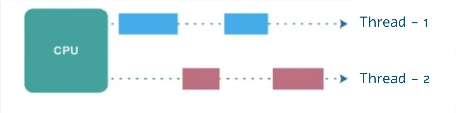
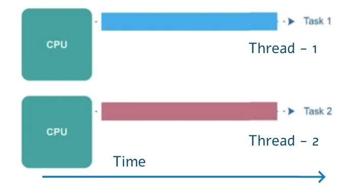
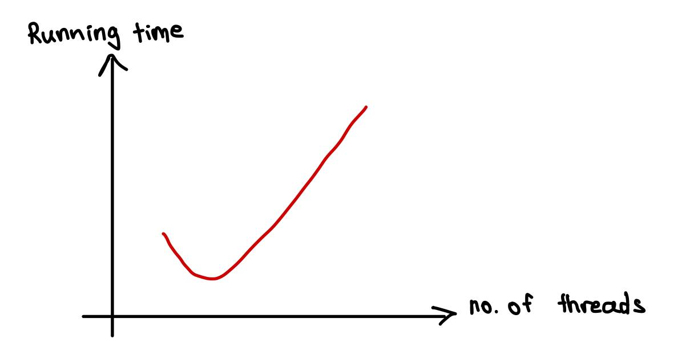
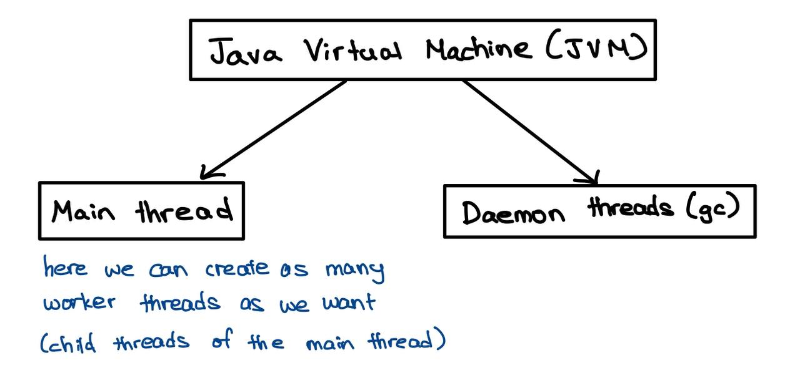
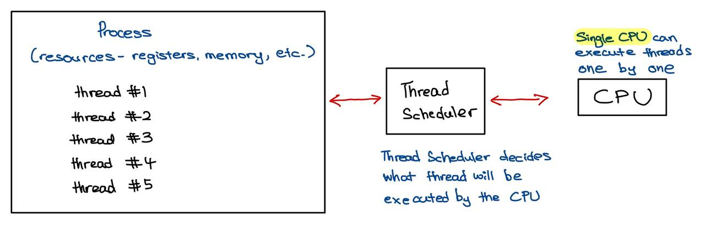
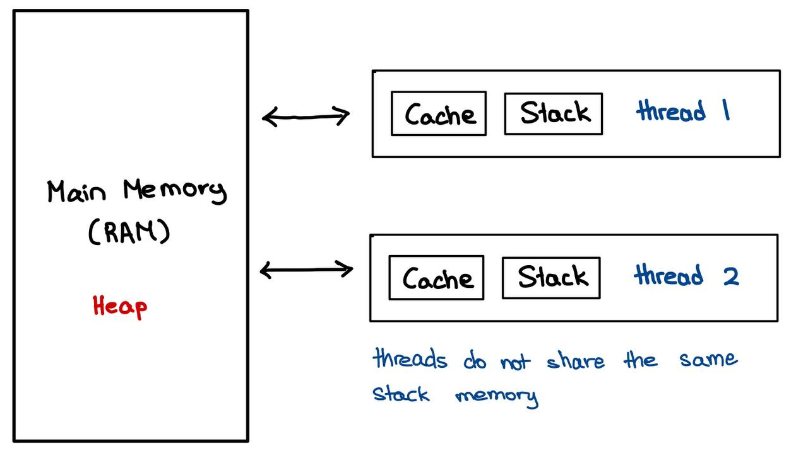
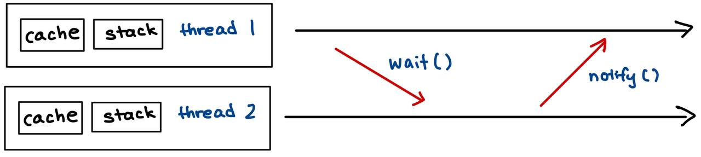
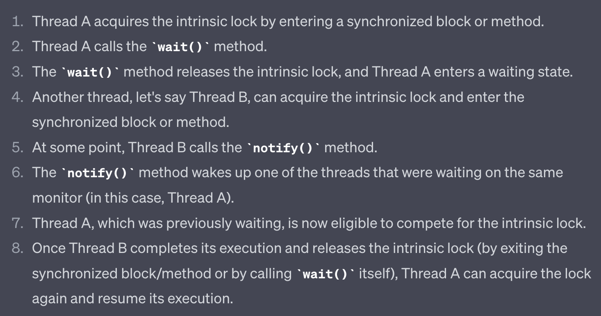
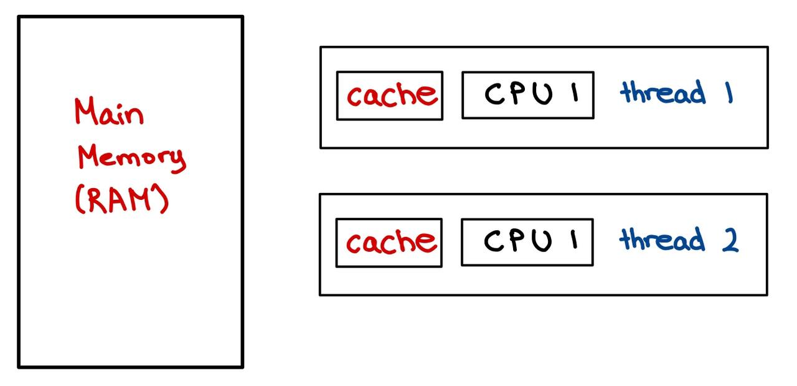

# Process and Threads Introduction

- By default, programming languages are sequential which means they execute the commands 1 by 1.
- In a **single-threaded application**, the operations are executed one after the other.

```java
public static void main(String[] args) {
    initializeArrays();
    downloadData(); // if this is time consuming, it may freeze the application
    buildModel();
    makePredictions();
}
```

- The reason for **multithreading** is to separate multiple (time-consuming) tasks that might be subjected to **interference by the execution of other tasks**.
- With multithreading, can achieve better resource utilization and improve performance in the main.
- For example (stock market application), the **application downloads real-time data from the web** and constructs time-series models (ARMA or ARIMA) based on the data.
  - Solution: Use multithreading and a distinct thread for this time consuming operation and the application will not freeze.
- Multithreading is the ability of the CPU to execute multiple processes or threads concurrently.
- Both threads and processes are **independent sequences** of execution.

## Processes

- A process is an instance of a **program execution**.
- For example, when you open a software (Paint, Excel, etc) or web browser - these are distinct processes.
- The operating system (OS) assigns distinct **registers, stack memory and heap memory** to every single process.
- In Java, we can create processes with the `ProcessBuilder` class.
- Processes rely on the parent process (expensive).
- Process refers to an executing program, which would be running the Java application itself.

## Threads

- A thread is a **light-weight** process.
- It is a unit of execution _within a given process_, so a single process may contain several threads.
- Each **thread in a process shares the memory and resources**.
- Creating new threads require _fewer resources_ that creating new processes, does not affect the parent process.
- Concurrent Programming: ensure that different threads in the same process are using the same memory.
- The optimal number of threads is the number of processors (or processor cores) of the computer because this can make the application run parallel instead of a multithreaded application.

## Time-Slicing Algorithm

- Time-slicing means that processing time is shared among processes and threads.
- A single CPU has to deal with all the `k threads` in the application.
- Processing time for a single processor is shared among multiple processes or threads.
- The following diagram illustrates the time-slicing algorithm when the single processor handles _thread #1_ for a short amount of time and then _thread #2_, and so on...



- When there are multiple processors (or cores), then all the threads can be executed in a parallel manner. No need for time slicing algorithm.



## Benefits of Multithreading

- Can design more **responsive application**, can perform several operations concurrently.
- Can achieve **better resource utilization** (CPU utilization). By default, every Java application is single threaded. Can utilize **more CPU cores** with multiple threads.
- Can **improve performance** by utilizing CPU cores and run the threads in parallel.

## Downsides of Multithreading

- Threads are manipulating data that are located on the **same memory area** because they belong the same process - synchronization is not that straight-forward.
  - data may become inconsistent if multiple threads are manipulating the same data at the same time.
- Difficult to design and test/debug multithreaded applications.
- **Using multiple threads is expensive** - CPU has to save local data, application pointer, etc. of the current thread and has to load the other thread as well.
  - Switching between threads is a long operation. (expensive)



- It is **expensive to switch between multiple threads** - this is why an algorithm may become too slow with multiple threads.
- **RULE OF THUMB**: For small problems and applications, it is unnecessary to use multiple threads.

## Thread Lifecycle

1. `New` State
   - Every thread is in the new state until we call the `start()` method.
2. `Active` State
   - When we call the `start()` method on the given thread.
   - There are 2 sub-states:
     - `runnable`: ready to be executed but may not be currently executing because CPU is running another thread due to the time-slicing algorithm.
     - `running`: when the thread's turn comes, it enters the running state and executes the `run()` method.
3. `Blocked` / `Waiting` State
   - In this state, a thread is temporarily inactive and not consuming CPU time.
   - The thread may enter the blocked state or waiting state for various reasons, such as waiting for I/O operations, waiting for synchronization, or explicitly calling methods like `join()` or `sleep()`.
     - `join()`: waiting for another thread to be completed.
   - The _Thread Scheduler_ is responsible for resuming a blocked or waiting thread when the condition it was waiting for is satisfied.
4. `Terminated` State
   - When a thread has finished it's task.

## 3 Methods to Start Threads

1. Implementing the `Runner` interface

```java
class Runner2 implements Runnable {
    @Override
    public void run() {
        for (int i = 0; i < 10; i++) {
            System.out.println("Runner2: " + i);
        }
    }
}

public class Main {
    public static void main(String[] args) {
        Thread t2 = new Thread(new Runner2());
        t1.start();
    }
}
```

2. Extending the `Thread` class

```java
class Runner1 extends Thread {
    @Override
    public void run() {
        for (int i = 0; i < 10; i++) {
            System.out.println("Runner1: " + i);
        }
    }
}

public class Main {
    public static void main(String[] args) {
        Thread t1 = new Runner1();
        t1.start();
    }
}
```

3. Creating a inline thread

```java
    public static void main(String[] args) {
        Thread t3 = new Thread(new Runnable() {
            @Override
            public void run() {
                for (int i = 0; i < 10; i++) {
                    System.out.println("Runner3: " + i);
                }
            }
        });
        t3.start();
    }
```

## Use `Runnable` interface or `Thread` classes?

- Usually using the `Runnable` interface approach is preferred.
  - If we extends `Thread` then we can't extend any other class (usually a huge disadvantage) because in Java, a given class can extends one class exclusively.
  - A class may implement more interfaces as well - so implementing the `Runnable` interface can do no harm in the software logic.

## `sleep()`

- `Thread.sleep()` pauses the execution of the current thread for a specified duration (in _milliseconds_).
- Introduces delays or pauses in the program's execution.
- `Thread.sleep()` method can be used for controlling the timing of certain operations or introducing delays between actions.
- Throws an `InterruptedException` if the thread is interrupted by another thread.

## `join()`

- `Thread.join()` allows one thread to wait for the completion of another thread.
- When a thread invokes the `join()` method on another thread, it waits for that thread to finish its execution before continuing its own execution.
- In the example below:
  - By calling `t1.join()`, the main thread waits for `t1` to finish execution before continuing. Same for `t2`.
  - The `join()` calls ensure that the output from the main thread ("Finished with Threads...") is only printed once both `t1` and `t2` have finished their tasks.

```java
t1.start();
t2.start();

try {
    t1.join(); // Main thread waits for thread1 to complete
    t2.join(); // Main thread waits for thread2 to complete
} catch (InterruptedException e) {
    e.printStackTrace();
}

System.out.println("Finished with Threads...");
```

# Daemon and Worker Threads

- A thread in Java can be **daemon thread** or a standard **worker thread**.
- When a Java program starts, then one thread begins running immediately, i.e., `main` thread. It starts the main method.
- Can create child threads from the `main` thread. The main thread is the last thread to finish execution because it performs various shutdown operations.
- **daemon threads** are intended as helper threads, e.g., for garbage collection.



- Daemon threads are _low priority_ threads that run in the background to perform tasks such as garbage collection.
- Usually we create daemon threads for I/O operations or services (smartphone services such as NFC or Bluetooth communication).
  - Can create a daemon thread for a smartphone application to look for smart-watches to pair with.
- Daemon threads are **terminated by the JVM when all other worker threads are terminated** (finish execution).
  - They do not prevent the JVM from exiting when all non-daemon threads have finished executing.
  - When all worker threads have completed their execution, the JVM terminates any remaining daemon threads without allowing them to finish their work.
  - Recommended to use daemon threads for tasks that are safe to be terminated abruptly and do not require precise completion.
- _Main difference_: worker threads are not terminated while daemon threads are interrupted by the JVM.

```java
// Setting a thread as a Daemon Thread
t1.setDaemon(true);
```

## Thread Priority



- Time-slicing algorithm is handled by Thread Scheduler.
- Can assign a priority value (1-10) to every Thread
  - default priority value is 5
  - `MIN_PRIORITY`: 1
  - `MAX_PRIORITY`: 10
- Threads with the _same priority_ value (default priority is 5) are executed in a **FIFS** (first-in-first-served) manner - the thread scheduler store the threads in a **queue**.
- Higher priority threads are executed before lower priority threads but it depends on the underlying OS (thread starvation is avoided).
  - E.g., main thread with default priority of 5 could be executed before threads with priority of 10.

```java
// Thread with priority 10
Thread t = new Thread(new WorkerThread());

t.setPriority(Thread.MAX_PRIORITY);
t.start();
```

# Memory Management of Threads



- Threads (of the same process) run in a shared memory space, while processes run in separate memory spaces.

| Stack Memory                                              | Heap Memory              |
| --------------------------------------------------------- | ------------------------ |
| Stores local variables, method arguments and method calls | Stores object references |
| Fast                                                      | Slow                     |
| Smaller memory                                            | Larger memory            |

- Every thread has its own stack memory but all threads share the heap memory (shared memory space). Thus, synchronization is needed.
- The main purpose of **synchronization** is the sharing of resources without interference using mutual exclusion.
  - So that threads cannot interfere the sharing of resources in Heap Memory.

## Synchronization

- Located in `~/_004_thread_memory_synchronization`

```java
public void increment() {
    counter++;
}
```

- In the example below,
  - Reading the number from memory
  - Incrementing the value
  - Writing the number to memory
  - Return with the variable
- These operations seems to be atomic in the sense that requires only a single operation but this is not the case.
  - It takes some time to finish with the _increment operation_.
  - During this procedure, another thread may call this method as well with the original counter value.
  - If both threads call this method at the same time, they share the same variable `counter` memory.
    - counter = 0
    - Thread 1: counter = counter + 1 = 1
    - Thread 2: counter = counter + 1 = 1
    - Final value counter = 1

```java
public static synchronized void increment() {
    counter++;
}
```

- Using the `synchronized` keyword helps to ensure that this method is only executed by a single thread at a given time, provides mutual exclusion
- Provides **mutual exclusion**.
- Ensures **thread safety** when multiple threads access shared data or critical sections of code concurrently.
- If the methods are accessing different variables that are not shared among multiple threads, there is no risk of data inconsistency or race conditions, and synchronization is not required.
- **Race Condition**: occurs when 2 or more threads access shared data concurrently, leading to unpredictable and incorrect behavior due to the uncontrolled interleaving of their operations.

## Intrinsic Lock (Monitor Lock)

```java
public synchronized void increment() {
    counter++;
}
```

- Every object in Java has an intrinsic lock.
- "A thread that needs exclusive and consistent access to an object's fields has to acquire the object's intrinsic lock before accessing them, and then release the intrinsic lock when it's done with them."
- Due to the monitor lock, **no 2 threads can execute the same `synchronized` method at the same time**.
- Only a single thread can acquire the intrinsic lock of the class.
- When the `synchronized` keyword is used, the thread acquires the intrinsic lock of the application.
- Removing the `synchronized` keyword allows the method to be called without acquiring the intrinsic lock. (faster)
- When a method is declared as `synchronized`, it means that only 1 thread can execute that method at a time.
    - A thread owns the intrinsic lock between the time is has acquired the lock and released the lock.
    - If a thread owns an intrinsic lock, no other thread can acquire the same lock.
- If multiple threads attempt to execute a `synchronized` method simultaneously, the additional threads will be blocked until the lock is released by the executing thread.
- If multiple `synchronized` methods are present in an object, different threads may need to wait for each other to release the lock associated with that object before they can proceed. This can lead to potential performance issues and contention.

### Object level locking (Intrinsic Lock)

- This is called object level locking because we get the monitor lock (intrinsic lock) associated with the object itself.

```java
public synchronized void increment() {
    counter++;
}

// block level lock
public void increment() {
    synchronized(this) {
        counter++;
    }
}
```

### Class level locking (Intrinsic Lock)

```java
public static synchronized void increment() {
    counter++;
}

public static void increment() {
    synchronized(ClassName.class) {
        counter++;
    }
}
```

- This is called class level locking because we get the monitor lock (intrinsic lock) associated with the class.
- Block level locks are generally recommended as they do not configure other execution in the method to be synchronized. So, only synchronized specific executions in the method.

## Locking with Custom Objects

```java
private static final Object lock1 = new Object();
private static final Object lock2 = new Object();

public static void increment1() {
    synchronized (lock1) {
        counter1++;
    }
}

public static void increment2() {
    synchronized (lock2) {
        counter2++;
    }
}
```

- Both methods are using independent locks.

## Thread Communication (`wait` and `notify`)

- Threads that are locking on the same intrinsic lock (monitor) can release the lock until the other thread calls `notify`.
- `wait()` and `notify()` methods can be used and called from *synchronized* methods or blocks exclusively.



- If there are 2 threads using the same intrinsic lock, the first thread goes into a waiting state with `wait()` but the second thread doesn't execute `notify()`, then thread 1 will be in the waiting state infinitely. This is called **deadlock**.

```java
class Process {

    public void produce() throws InterruptedException {
        synchronized (this) {
            System.out.println("Running the produce method...");
            wait(); 
            System.out.println("Again in the producer method...");
        }
    }

    public void consume() throws InterruptedException {
        Thread.sleep(1000);

        synchronized (this) {
            System.out.println("Consume method is executed...");
            notify(); 
            Thread.sleep(5000);
        }
    }

}
```

- In the example above, the behavior of `wait()` and `notify()` is such that when a thread calls `notify()`, it only signals to another waiting thread that it can wake up and attempt to reacquire the lock.
- However, the actual reacquisition of the lock by the waiting thread is not immediate.
- The waiting thread will only be able to proceed and acquire the lock when the notifying thread releases the lock by exiting the **synchronized** block.
    1. `consume()` method prints "Consume method is executed..."
    2. `consume()` method sleeps for 5 seconds (while still holding the lock as the synchronized block has not yet been exited).
    3. After 5 seconds, the `consume()` method releases the lock by exiting the synchronized block.
    4. `produce()` method acquires the lock and continues execution, printing "Again in the producer method...".

## Difference between `wait()` and `sleep()`

|`wait()`|`sleep()`|
|---|---|
|Call `wait` on the Object.|Call `sleep` on the Thread itself.|
|`wait` can be the interrupted (need `InterruptedException`)|Sleep cannot be interrupted.|
|`wait` must happen in a synchronized block.|Sleep does not have to be in a synchronized block.|
|`sleep` does not release the locks it hold.|`wait` releases the lock on the object that `wait()` is called on.|

## Releasing the Intrinsic Lock

- 2 ways to release the intrinsic lock with `wait()` and `notify()`
    - When a thread calls the `wait()` method, it releases the intrinsic lock (AKA monitor lock) that it holds, allowing other threads to acquire it.
    - When a thread calls the `notify()` method, it does not directly release the lock to the waiting thread, the thread continues to execute until it releases the lock explicitly by **exiting the synchronized block/method**. 
- `notify()` is used to wake up one of the waiting threads that are waiting on the same monitor, allowing it to compete for the lock.
- The thread that calls `notify()` does not directly release the lock held by the waiting thread, it releases the lock itself at a later point.



## Reentrant Locks

- Reentrant locks provide the ability for a thread to acquire the same lock multiple times without deadlocking itself, as long as it releases the lock the same number of times.
- It has the same behavior as the "synchronized approach" with some additional features.

```java
private Lock lock = new ReentrantLock(); // works too as Lock is an interface and ReentrantLock implements Lock
private ReentrantLock lock = new ReentrantLock();
lock.lock();
lock.unlock();
```

- `new ReentrantLock(boolean fairness)`
    - If the `fairness` parameter is set to be TRUE then the longest waiting thread will get the lock. (by default).
    - If the `fairness` parameter is set to FALSE, then there is no access order.
- **IMPORTANT**: a good approach is to use `try-catch-finally` blocks when doing the critical section and call `unlock()` in the finally block.
- A thread cannot acquire a lock owned by another thread but a given thread can acquire a lock that it owns.
- Allowing a thread to acquire the same lock more than once is called *re-entrant synchronization*.
- Example:
    - Consider recursive method calls.
    - If a given thread calls a recursive and synchronized method several times, then it is fine (note that in this case the same thread "enters" the synchronized block several times).
    - There will be no deadlock because of re-entrant synchronization.

## Locks and Synchronized Blocks

|Lock (Reentrant)|Synchronized Blocks|
|---|---|
|Can make a lock fair (**prevent thread starvation**)|Unfair by default|
|Can check whether the given lock is held or not with `lock.isHeldByCurrentThread()` with `Reentrant` interface|Cannot check the lock status directly|
|Can get the **list of waiting threads** for the given lock|Cannot directly access the list of waiting threads|
|Need `try-catch-finally` block|Don't need `try-catch-finally` block|

## `volatile` Keyword

- `volatile` keyword in Java is used to indicate that a variable may be modified by multiple threads and it provides a lightweight synchronization mechanism for variables that are shared among threads.
- Used in scenarios where you have a variable that is accessed by multiple threads, and you want to ensure that changes made by 1 thread are immediately visible to other threads.
- Ensure that any read or write operation on the variable is directly performed on the main memory, rather than on a local cache specific to each thread.
- Guarantees visibility of changes made by 1 thread to other threads, helping to avoid certain subtle concurrency issues.



- Every read of a `volatile` variable will be read from the **RAM** so from the main memory (not from cache).
    - usually variables are cached for performance reasons
    - caches are faster. Do not use `volatile` keyword is not necessary (it prevents instruction reordering which is a performance boost technique).

## When to use the `volatile` keyword?

1. Flag variables:
    - `volatile` is commonly used for boolean flags that control the execution of threads.
    - For example, a flag to stop a thread's execution when set to `true`.
    - Using `volatile` ensures that the flag's value is always visible to other threads.
2. Status variables: 
    - If a variable represents the status of a shared resource and is updated by 1 thread, but read by multiple threads, marking it as `volatile` ensures that all threads see the most up-to-date status.
3. Performance considerations:
    - In some situations, using `volatile` can offer better performance compared to other synchronization mechanisms, especially when the shared variable is frequently read but rarely written.